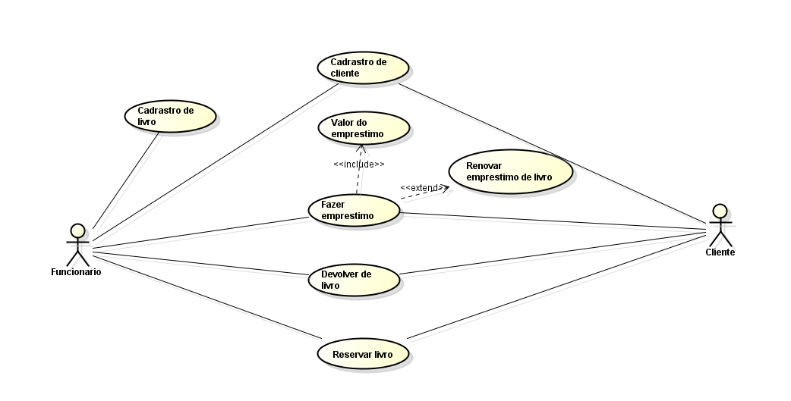

<!DOCTYPE html>
<html lang="pt-br">
<head>
	<meta charset="utf-8">
	<title>PDSdffdfs</title>
</head>
<body>
<h1>
Sistema Bibliotecário
</h1>

O sistema bibliotecário é um software que tem como objetivo administrar o empréstimo de livros. Utilizando o software, o usuário - em geral, funcionário e cliente, poderá gerenciar os empréstimos de livros. O sistema contará com as seguintes funcionalidades: cadastrar cliente, cadastrar livro, emprestar livro, devolver livro, fazer reserva, valor do empréstimo e renovar empréstimo de livro.
Diante da demanda de empréstimos e de livros, o software será um facilitador para o gerenciamento da biblioteca.

<h2>
Requisitos Funcionais
</h2>

Casos de uso:
<ol>
	<a href="CadastrarCliente.html"> <li>Cadastrar Cliente</li></a>
	<a href="CadastrarLivro.html"> <li>Cadastrar Livro</li></a>
	<a href="EmprestarLivro.html"> <li>Emprestar Livro</li></a>
	<a href="DevolverLivro.html"> <li>Devolver Livro</li></a>
	<a href="FazerReserva.html"> <li>Fazer Reserva</li></a>
	<a href="ValorEmprestimo.html"> <li>Valor do Empréstimo</li></a>
	<a href="RenovacaoLivro.html"> <li>Renovar Empréstimo do Livro</li></a>
</ol>

<h2>
Requisitos não-funcionais
</h2>

<h2>Acesso ao Sistema</h2>
O acesso ocorre mediante a autenticação do cliente sendo que o acesso ao conteúdo da biblioteca diferencia de acordo com o cliente.

<h2>Confiabilidade</h2>
O sistema não deverá realizar empréstimos caso o livro desejado não esteja disponível.

<h2>Desempenho</h2>
Para as operações empréstimo e renovação será gerado comprovante de confirmação contendo algumas informações do livro, horário e data.

<h2>Acervo permanente</h2>
Cada livro terá uma identificação para que haja um controle de empréstimo, sendo assim, para que não aconteça uma ambiguidade. 

<h2>Disponibilidade</h2>
A biblioteca deve estar disponível 6 dias por semana, 24 horas por dia. O sistema não pode ficar mais que 10 segundos fora do ar em um dia.

<h2>Controle de estoque</h2>
O Sistema deve informar quando houver a falta de livros de um determinado empréstimo, tentando evitar que livros fiquem indisponível por muito tempo, e caso necessário pedir uma nova compra de livros.

</li>
</body>
</html>
